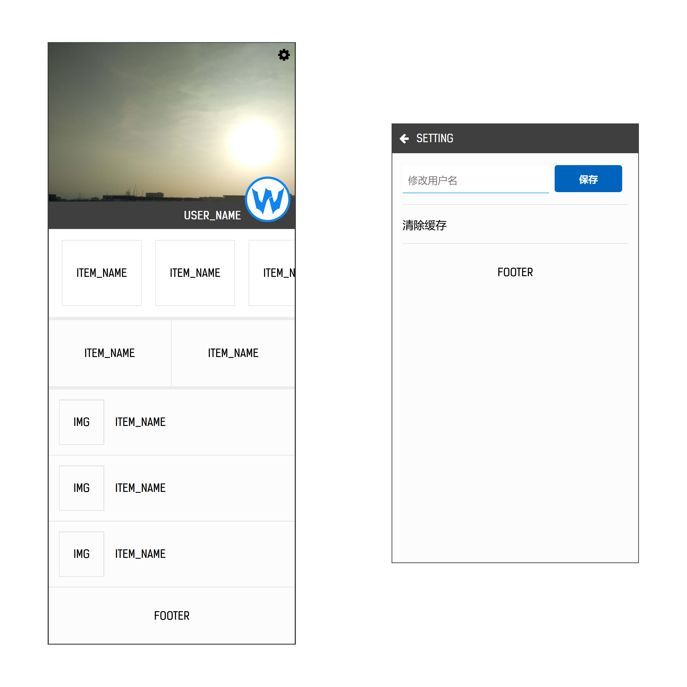

# Bona Storm #

## 安装 ##

```
npm i
```

## 启动 ##

视图层开发:  

```
// 启动开发模式打包
npm run build-dev

// 启动生产模式打包
npm run build-prod

// 启动本地页面调试服务器
npm run dev
```

数据层开发:   

```
// 启动本地接口监听
npm run watch

// 启动开发模式服务器接口
npm run start-dev-server

// 启动生产模式服务器接口
npm run start-prod-server
```

## 预览图 ##



预览图 1

---

```
CREATE DATE: 2018-07-19
```
